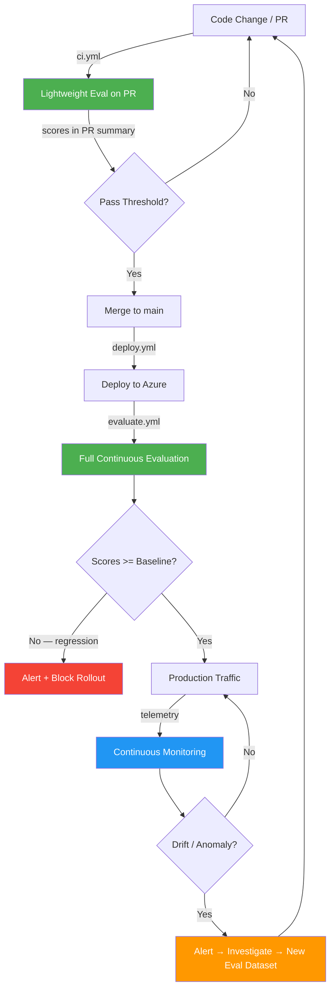
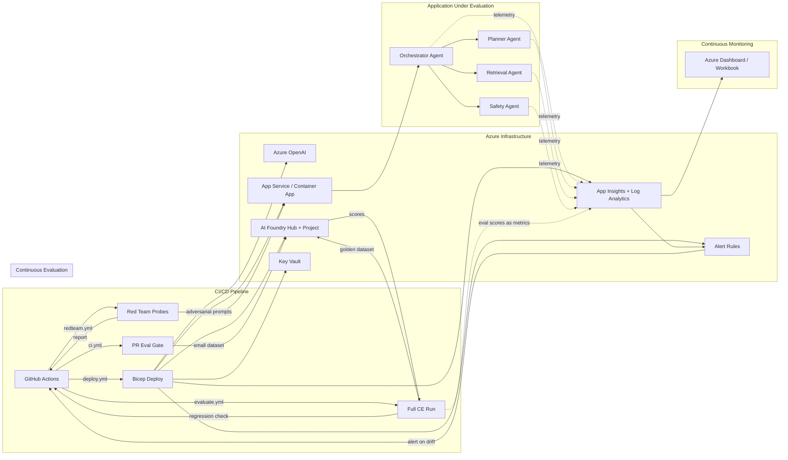

# Copilot Instructions — azure-ai-redteam-eval

> **Purpose**: Demo repository for a 15-minute talk — *"Continuous Evaluation & Monitoring for AI Applications"*. **Continuous Evaluation (CE)** and **Continuous Monitoring (CM)** are the hero concepts. A multi-agent system built with the **Microsoft Agent Framework** (`agent-framework`) serves as the *application under evaluation*. The repo showcases automated Azure AI Foundry evaluations, AI red teaming, regression detection, and observability — all wired into CI/CD with Bicep IaC.

---

## 1. Talk Context & Constraints

| Field | Value |
|-------|-------|
| **Title** | Continuous Evaluation & Monitoring for AI Applications |
| **Duration** | 15 minutes |
| **Format** | Informal / meetup — no slides. Everything presented from the GitHub repo (Mermaid diagrams in markdown, code walkthroughs, terminal demos, Azure Portal dashboard). |
| **Core thesis** | GenAI apps need the same CI/CD rigour as traditional apps — plus Continuous Evaluation (CE) and Continuous Monitoring (CM) for safer deployments and faster feedback loops. |
| **Key takeaway** | AI apps need CI/CD + Continuous Evaluation to be production-safe. |
| **Audience** | Mixed developer audience (platform engineers, AI/ML practitioners, DevOps leads) |
| **Demo flow** | CE/CM lifecycle diagram → architecture → brief agent demo → **Continuous Evaluation** (full eval + regression check + PR gating) → **Red Teaming** → **Continuous Monitoring** (dashboard) → CI/CD pipeline → takeaway |

When generating code or content, keep demos **concise, self-contained, and runnable within 5 minutes** so they fit inside a live talk. **CE/CM must be the most prominent concepts** — in folder names, diagram labels, README sections, and workflow comments.

---

## 2. Repository Structure

```
azure-ai-redteam-eval/
├── .github/
│   ├── copilot-instructions.md         # THIS FILE
│   └── workflows/
│       ├── ci.yml                      # PR gate: lint + tests + lightweight eval
│       ├── deploy.yml                  # Deploys infra + app via Bicep & az cli
│       ├── evaluate.yml                # CE: full evaluation post-deploy + regression check
│       └── redteam.yml                 # CE: AI red-team probes (weekly)
│
├── infra/
│   ├── main.bicep                      # Orchestrator — deploys all modules
│   ├── modules/
│   │   ├── ai-foundry.bicep            # Azure AI Foundry hub + project
│   │   ├── openai.bicep                # Azure OpenAI resource + model deployments
│   │   ├── app-service.bicep           # App Service (or Container App) for agent host
│   │   ├── monitoring.bicep            # Application Insights + Log Analytics
│   │   ├── alerts.bicep                # Azure Monitor alert rules (score drop, latency, safety)
│   │   ├── key-vault.bicep             # Key Vault for secrets
│   │   └── managed-identity.bicep      # User-assigned managed identity + RBAC
│   └── parameters/
│       ├── dev.bicepparam               # Dev environment parameters
│       └── prod.bicepparam              # Prod environment parameters
│
├── src/
│   ├── agents/                          # The "application under evaluation" — kept lean
│   │   ├── __init__.py
│   │   ├── orchestrator.py             # Top-level multi-agent orchestrator (~40 lines core)
│   │   ├── planner_agent.py            # Plans tasks and delegates
│   │   ├── retrieval_agent.py          # RAG / grounding agent
│   │   ├── safety_agent.py             # Content-safety guardrail agent
│   │   └── plugins/                    # Agent Framework tools / plugins
│   │       ├── __init__.py
│   │       ├── search_plugin.py
│   │       └── eval_plugin.py
│   │
│   ├── continuous_evaluation/           # ★ CE — the hero concept
│   │   ├── __init__.py
│   │   ├── run_evaluation.py           # Full eval: all evaluators + golden dataset + thresholds
│   │   ├── run_pr_evaluation.py        # Lightweight eval for PRs (small dataset subset)
│   │   ├── evaluators.py              # Built-in + safety + custom evaluator definitions
│   │   ├── thresholds.py              # Central pass/warn/fail threshold definitions
│   │   ├── regression_check.py        # Compare current vs. previous scores, detect regressions
│   │   ├── score_tracker.py           # Log eval scores as App Insights custom metrics
│   │   ├── metrics.py                 # Parse & format evaluation results into tables
│   │   └── datasets/
│   │       ├── eval_golden.jsonl       # Full golden eval dataset (10-15 rows)
│   │       ├── eval_golden_small.jsonl # PR subset (5 rows) for fast CI eval
│   │       └── adversarial_prompts.jsonl# Red-team prompt dataset
│   │
│   ├── redteam/                         # Part of CE — adversarial evaluation
│   │   ├── __init__.py
│   │   ├── run_redteam.py             # Entry point: AdversarialSimulator invocation
│   │   ├── attack_strategies.py       # Prompt-injection, jailbreak, PII-leak patterns
│   │   └── report.py                  # Generate JSON + markdown report
│   │
│   ├── continuous_monitoring/           # ★ CM — the other hero concept
│   │   ├── __init__.py
│   │   ├── telemetry.py               # OpenTelemetry + App Insights instrumentation
│   │   ├── eval_metrics_exporter.py   # Export eval scores as OTel metrics → App Insights
│   │   ├── alert_rules.py            # Define alert conditions (score drop, latency, safety)
│   │   └── dashboards/
│   │       └── ce_cm_dashboard.json   # Azure Workbook: Eval Trends + Agent Health + Alerts
│   │
│   ├── app.py                          # FastAPI entrypoint exposing agent endpoints
│   └── config.py                       # Pydantic settings (env vars, endpoints, thresholds)
│
├── tests/
│   ├── unit/
│   │   ├── test_evaluators.py
│   │   ├── test_thresholds.py
│   │   └── test_regression_check.py
│   └── integration/
│       └── test_agent_flow.py
│
├── docs/
│   ├── ce-cm-lifecycle.md              # ★ Hero diagram: CE/CM feedback loop
│   ├── architecture.md                 # Full architecture Mermaid (CE/CM-centric)
│   └── talk-script.md                  # Minute-by-minute speaker notes
│
├── fallback/                           # Pre-baked demo outputs (safety net)
│   ├── evaluation_results.json
│   ├── regression_comparison.md
│   ├── redteam_report.md
│   └── agent_demo_output.txt
│
├── tasks.md                            # Implementation task tracker
├── pyproject.toml                      # Python project config (uv / pip)
├── requirements.txt                    # Pinned dependencies
├── Makefile                            # Dev commands: evaluate, redteam, regression-check, etc.
├── .env.example                        # Template for local env vars
├── .gitignore
└── README.md                           # ★ Leads with CE/CM, not agents
```

---

## 3. Tech Stack & Conventions

### Language & Runtime
- **Python 3.12+** — all source code in `src/`.
- Use **type hints** everywhere; prefer `pydantic` models for configs & data contracts.
- Async-first: use `async/await` for agent orchestration and API endpoints.
- Package manager: **uv** (fallback: `pip`). Lock file: `uv.lock` or `requirements.txt`.

### Multi-Agent Framework
- Use the **Microsoft Agent Framework** (Python) as the primary agent framework.
  - SDK packages: `agent-framework-azure-ai` and `agent-framework-core` (latest pre-release).
  - Import from `agent_framework` — key classes: `Executor`, `WorkflowBuilder`, `WorkflowContext`, `ChatAgent`, `ChatMessage`.
  - Use the `@handler` decorator on `Executor` subclasses to define agent behavior.
  - Wire agents together using `WorkflowBuilder` fluent API: `add_edge()`, `set_start_executor()`, `build()`.
  - For Azure AI Foundry: use `AzureAIClient(project_endpoint=..., credential=DefaultAzureCredential())`.
  - For Azure OpenAI directly: use `AzureOpenAIChatClient(endpoint=..., credential=..., model=...)`.
  - Agent names must be alphanumeric (hyphens OK in middle, no underscores, max 63 chars).
  - Each agent is a separate `Executor` subclass in `src/agents/` with a clear single responsibility.

### Continuous Evaluation (CE) — the Hero Concept
- CE means: **every code change and every deployment is automatically evaluated for AI quality before reaching users.**
- Use `azure-ai-evaluation` SDK (>= 1.0.0).
- Evaluators to showcase:
  - **Built-in**: `GroundednessEvaluator`, `CoherenceEvaluator`, `RelevanceEvaluator`, `FluencyEvaluator`.
  - **Safety**: `ContentSafetyEvaluator`, `ProtectedMaterialEvaluator`.
  - **Custom**: at least one custom evaluator in `src/continuous_evaluation/evaluators.py`.
- **Threshold gating**: `src/continuous_evaluation/thresholds.py` defines pass/warn/fail per evaluator. Pipelines fail if scores fall below thresholds.
- **Regression detection**: `src/continuous_evaluation/regression_check.py` compares current run against a stored baseline. Regressions block deployment.
- **Score tracking**: `src/continuous_evaluation/score_tracker.py` pushes eval scores as App Insights custom metrics — bridging CE into CM.
- **PR-level evaluation**: `src/continuous_evaluation/run_pr_evaluation.py` runs a lightweight eval (5-row dataset) on every PR via `ci.yml`.
- Evaluation datasets live in `src/continuous_evaluation/datasets/` as `.jsonl` files.
- Full eval entry point: `src/continuous_evaluation/run_evaluation.py` — callable from CLI & CI.

### AI Red Teaming (Part of CE)
- Red teaming is **adversarial evaluation** — a CE tool that stress-tests the system.
- Use `azure-ai-evaluation` red-team capabilities (`AdversarialSimulator` or the red-team SDK).
- Attack categories: prompt injection, jailbreak attempts, PII extraction, harmful-content generation.
- Red-team entry point: `src/redteam/run_redteam.py`.
- Output a structured report (JSON + markdown summary).
- Runs weekly via `redteam.yml`; critical findings block deployments.

### Infrastructure as Code
- **Bicep only** — no Terraform, no ARM JSON.
- All Bicep in `infra/`; modular design under `infra/modules/`.
- `main.bicep` is the orchestrator that calls all modules.
- Parameter files use `.bicepparam` format (Bicep parameters, not JSON).
- Resources to provision:
  - Azure AI Foundry hub + project
  - Azure OpenAI (GPT-4o model deployment)
  - Azure App Service or Container App (agent host)
  - Application Insights + Log Analytics workspace
  - Key Vault
  - User-assigned Managed Identity with scoped RBAC
- Always use **managed identity** for service-to-service auth; never hardcode keys.
- Tag all resources: `project: azure-ai-redteam-eval`, `environment: <env>`.

### CI/CD — GitHub Actions
- Four workflows in `.github/workflows/`:

| Workflow | Trigger | Steps | CE/CM Role |
|----------|---------|-------|------------|
| `ci.yml` | `pull_request` → `main` | Checkout → Lint → Type check → Unit tests → Lightweight eval (5 rows) → Post scores to `$GITHUB_STEP_SUMMARY` | **CE gate on every PR** |
| `deploy.yml` | push to `main`, manual | Login → Bicep lint → Bicep deploy (incl. alerts) → Smoke test | Infra |
| `evaluate.yml` | after deploy, manual, scheduled | Full eval → Regression check → Score tracking → Upload artifact → Fail if regression | **CE post-deploy** |
| `redteam.yml` | manual, scheduled (weekly) | Red-team probes → Upload report → Fail if critical findings | **CE adversarial** |

- Use **OIDC federated credentials** for Azure login (`azure/login@v2`).
- Pin all action versions to SHA.
- Store secrets in GitHub → referenced via `${{ secrets.* }}`.

### Continuous Monitoring (CM) — the Other Hero Concept
- CM means: **production AI systems are monitored for quality drift, anomalies, and safety violations in real time.**
- **OpenTelemetry** traces + metrics exported to **Application Insights**.
- Every agent call, LLM invocation, and evaluation run emits telemetry.
- **Eval scores as metrics**: `src/continuous_monitoring/eval_metrics_exporter.py` bridges CE → CM by exporting scores as OTel custom metrics.
- **Alert rules**: `src/continuous_monitoring/alert_rules.py` defines programmatic alert conditions; `infra/modules/alerts.bicep` deploys them as IaC.
- Provide an Azure Workbook / Dashboard JSON template in `src/continuous_monitoring/dashboards/`.
- Dashboard has **three sections** matching the talk narrative:
  1. **Evaluation Trends** (CE) — Groundedness, Coherence, Relevance, Safety scores over time
  2. **Agent Health** (CM) — Latency P50/P95/P99, error rate, token usage
  3. **Alerts & Regressions** (CE+CM) — score regressions, safety flags, active alerts

### Documentation
- `README.md` — **leads with CE/CM** (hero Mermaid lifecycle diagram, "What is CE?", "What is CM?"), then quick-start (evaluate → redteam → dashboard → agents), repo structure, prerequisites.
- `docs/ce-cm-lifecycle.md` — the hero diagram: CE/CM feedback loop with detailed explanation per stage.
- `docs/architecture.md` — full architecture Mermaid narrated through CE/CM lens (not agent-centric).
- `docs/talk-script.md` — minute-by-minute speaker notes mapped to the revised demo timeline.

---

## 4. Code Style & Quality

| Rule | Detail |
|------|--------|
| Formatting | `ruff format` (line length 120) |
| Linting | `ruff check` with `select = ["E", "F", "I", "UP", "B", "SIM"]` |
| Type checking | `pyright` in strict mode |
| Docstrings | Google style; required on every public function and class |
| Tests | `pytest` + `pytest-asyncio`; minimum structure in `tests/unit/` and `tests/integration/` |
| Commit messages | Conventional Commits (`feat:`, `fix:`, `docs:`, `ci:`, `infra:`) |
| Branch strategy | `main` (protected), feature branches via PR |

---

## 5. Key Principles for Code Generation

1. **Demo-first**: every piece of code should be runnable end-to-end for the 15-min talk. Avoid stubs or TODOs that would break a live demo.
2. **Security by default**: managed identity, Key Vault references, no secrets in code or logs.
3. **Observable**: every significant action logs structured telemetry.
4. **Idempotent deployments**: Bicep deployments and evaluation runs can be re-executed safely.
5. **Fail-fast in CI**: evaluation and red-team workflows should gate deployments — fail the pipeline if quality scores drop below thresholds.
6. **Minimal dependencies**: only add packages that are strictly needed; prefer Azure SDK + Agent Framework.

---

## 6. Environment Variables (`.env.example` template)

```env
# Azure
AZURE_SUBSCRIPTION_ID=
AZURE_RESOURCE_GROUP=
AZURE_LOCATION=eastus2

# Azure OpenAI
AZURE_OPENAI_ENDPOINT=
AZURE_OPENAI_DEPLOYMENT=gpt-4o
AZURE_OPENAI_API_VERSION=2024-12-01-preview

# Azure AI Foundry
AZURE_AI_FOUNDRY_PROJECT=
AZURE_AI_FOUNDRY_ENDPOINT=

# Application Insights
APPLICATIONINSIGHTS_CONNECTION_STRING=

# Local dev
LOG_LEVEL=INFO
```

---

## 7. Mermaid Diagram References

### 7a. Hero Diagram: CE/CM Lifecycle Loop

This is the first thing the audience sees. Embed in `README.md` and `docs/ce-cm-lifecycle.md`:



### 7b. Full Architecture Diagram

Use in `docs/architecture.md`. Narrate through CE/CM lens:



---

## 8. Dependency Reference

```
# Core — Microsoft Agent Framework
agent-framework-azure-ai>=1.0.0b260107
agent-framework-core>=1.0.0b260107
azure-identity>=1.19.0
azure-ai-evaluation>=1.0.0

# API
fastapi>=0.115.0
uvicorn>=0.32.0

# Observability
opentelemetry-api>=1.28.0
opentelemetry-sdk>=1.28.0
azure-monitor-opentelemetry>=1.6.0

# Config
pydantic>=2.10.0
pydantic-settings>=2.7.0
python-dotenv>=1.0.0

# Dev / Test
pytest>=8.0.0
pytest-asyncio>=0.24.0
ruff>=0.8.0
pyright>=1.1.390
```

---

## 9. Checklist — What "Done" Looks Like

### Continuous Evaluation
- [ ] `src/continuous_evaluation/run_evaluation.py` produces evaluation scores via Azure AI Foundry.
- [ ] `src/continuous_evaluation/run_pr_evaluation.py` runs lightweight eval for PRs in < 60 seconds.
- [ ] `src/continuous_evaluation/regression_check.py` detects score regressions and outputs before/after diff.
- [ ] `src/continuous_evaluation/thresholds.py` gates pipeline on configurable thresholds.
- [ ] `src/continuous_evaluation/score_tracker.py` pushes eval scores as App Insights custom metrics.
- [ ] `src/redteam/run_redteam.py` executes adversarial probes and generates a report.

### Continuous Monitoring
- [ ] `src/continuous_monitoring/telemetry.py` emits traces to Application Insights.
- [ ] `src/continuous_monitoring/eval_metrics_exporter.py` exports eval scores as OTel metrics.
- [ ] `src/continuous_monitoring/dashboards/ce_cm_dashboard.json` renders 3-section dashboard (Eval Trends, Agent Health, Alerts).
- [ ] `infra/modules/alerts.bicep` deploys alert rules for score drop, latency spike, safety flags.

### Application & Infrastructure
- [ ] `src/agents/orchestrator.py` runs a multi-agent conversation end-to-end.
- [ ] `infra/main.bicep` deploys all resources successfully with `az deployment group create`.

### CI/CD & Pipeline
- [ ] `ci.yml` gates PRs with lint + tests + lightweight eval and posts scores to PR summary.
- [ ] `evaluate.yml` runs full eval + regression check post-deploy.
- [ ] `redteam.yml` runs weekly and fails on critical findings.
- [ ] `deploy.yml` deploys infra including alert rules.
- [ ] All four GitHub Actions workflows pass on a clean `main` push.

### Presentation
- [ ] `README.md` leads with CE/CM lifecycle Mermaid diagram.
- [ ] `docs/ce-cm-lifecycle.md` hero diagram renders correctly on GitHub.
- [ ] `docs/architecture.md` full diagram renders correctly on GitHub.
- [ ] The entire demo can be walked through in ≤ 15 minutes.
