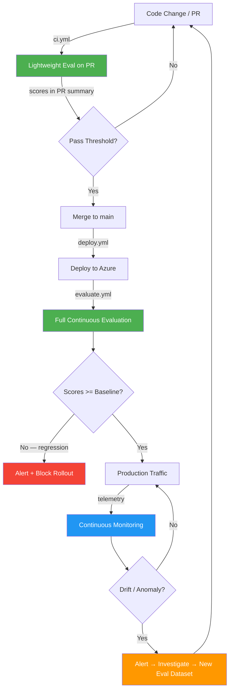
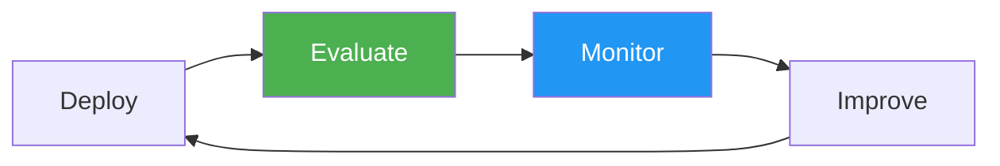

# Continuous Evaluation & Monitoring for AI Applications

> **GenAI apps need the same CI/CD rigour as traditional apps — plus Continuous Evaluation and Continuous Monitoring for safer deployments and faster feedback loops.**

---

## The CE/CM Lifecycle

Every code change flows through an automated quality loop before reaching users:



---

## What is Continuous Evaluation (CE)?

**Every code change and every deployment is automatically evaluated for AI quality before reaching users.** CE runs built-in and custom evaluators (groundedness, coherence, relevance, safety) against golden datasets. Scores are compared to baselines — regressions block deployment. Red teaming is adversarial CE that stress-tests the system with prompt injection, jailbreak, and PII extraction attacks.

## What is Continuous Monitoring (CM)?

**Production AI systems are monitored for quality drift, anomalies, and safety violations in real time.** CM exports evaluation scores as custom metrics to Application Insights, alongside agent latency, error rates, and token usage. Alert rules fire when scores drop or safety flags spike — feeding back into the CE loop.

---

## Quick Start

### Prerequisites

- Python 3.12+
- Azure subscription with Azure OpenAI, AI Foundry, and Application Insights deployed
- `az login` completed with appropriate permissions
- Copy `.env.example` → `.env` and fill in values

### Install

```bash
make install
```

### Run Continuous Evaluation

```bash
# Full evaluation against golden dataset (10-15 rows)
make evaluate

# Lightweight PR evaluation (5 rows — used in CI)
make evaluate-pr

# Compare scores against baseline — detect regressions
make regression-check
```

### Run Red Teaming

```bash
make redteam
```

### Run the Agent Demo

```bash
make agent-demo
```

### Run All CI Checks

```bash
make ci   # lint + format-check + typecheck + unit tests + PR eval
```

---

## Architecture

See [docs/architecture.md](docs/architecture.md) for the full CE/CM-centric architecture diagram.

See [docs/ce-cm-lifecycle.md](docs/ce-cm-lifecycle.md) for a detailed walkthrough of the CE/CM feedback loop.

---

## Repository Structure

```
azure-ai-redteam-eval/
├── .github/workflows/
│   ├── ci.yml               # PR gate: lint + tests + lightweight eval
│   ├── deploy.yml            # Bicep deploy to Azure
│   ├── evaluate.yml          # CE: full eval + regression check post-deploy
│   └── redteam.yml           # CE: adversarial probes (weekly)
│
├── src/
│   ├── continuous_evaluation/ # ★ CE — evaluators, thresholds, regression detection
│   ├── continuous_monitoring/ # ★ CM — telemetry, metrics export, alerts, dashboard
│   ├── redteam/               # Adversarial evaluation (part of CE)
│   ├── agents/                # Multi-agent system (the app under evaluation)
│   ├── app.py                 # FastAPI entrypoint
│   └── config.py              # Pydantic settings
│
├── infra/                     # Bicep IaC (AI Foundry, OpenAI, App Insights, alerts)
├── tests/                     # Unit + integration tests
├── docs/                      # Mermaid diagrams + talk script
├── fallback/                  # Pre-baked demo outputs (safety net)
└── tasks.md                   # Implementation tracker
```

---

## CI/CD Pipeline

| Workflow | Trigger | CE/CM Role |
|----------|---------|------------|
| `ci.yml` | Pull request → main | **CE gate** — lint, tests, lightweight eval on every PR |
| `deploy.yml` | Push to main / manual | Infra deployment via Bicep |
| `evaluate.yml` | Post-deploy / scheduled | **CE** — full eval, regression check, score tracking |
| `redteam.yml` | Manual / weekly | **CE adversarial** — red-team probes |

---

## Key Takeaway



**Add Continuous Evaluation and Continuous Monitoring to your AI pipelines today. The tooling exists. Fork this repo and try it.**

---

## License

MIT
