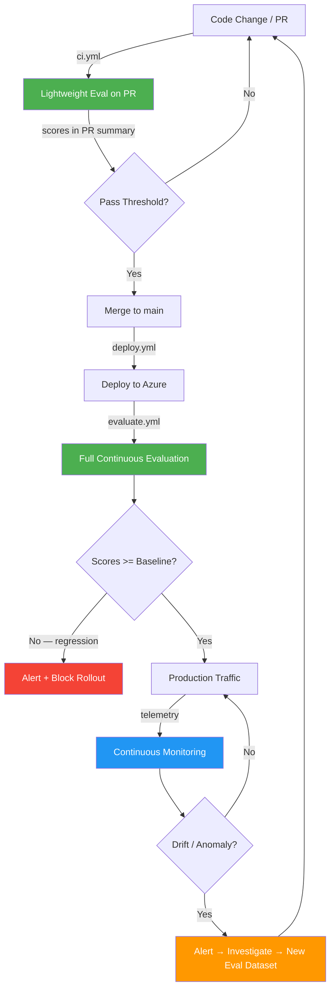
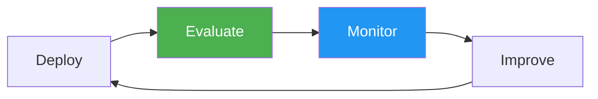

# Continuous Evaluation & Monitoring for AI Applications

> **GenAI apps need the same CI/CD rigour as traditional apps — plus Continuous Evaluation and Continuous Monitoring for safer deployments and faster feedback loops.**

[](#ci-cd-pipeline)
[](#latest-evaluation-results)
[](#latest-red-team-results)
[](https://python.org)

---

## The CE/CM Lifecycle

Every code change flows through an automated quality loop before reaching users:



---

## What is Continuous Evaluation (CE)?

**Every code change and every deployment is automatically evaluated for AI quality before reaching users.** CE runs built-in and custom evaluators (groundedness, coherence, relevance, fluency, conciseness, safety) against golden datasets. Scores are compared to baselines — regressions block deployment. Red teaming is adversarial CE that stress-tests the system with prompt injection, jailbreak, and PII extraction attacks.

## What is Continuous Monitoring (CM)?

**Production AI systems are monitored for quality drift, anomalies, and safety violations in real time.** CM exports evaluation scores as custom metrics to Application Insights, alongside agent latency, error rates, and token usage. Alert rules fire when scores drop or safety flags spike — feeding back into the CE loop.

---

## Latest Evaluation Results

Scores from the most recent full evaluation run against the 10-row golden dataset:

| Evaluator | Score | Threshold | Status |
|-----------|-------|-----------|--------|
| Groundedness | **4.70** | ≥ 4.0 | ✅ PASS |
| Coherence | **4.00** | ≥ 4.0 | ✅ PASS |
| Relevance | **4.60** | ≥ 4.0 | ✅ PASS |
| Fluency | **4.10** | ≥ 4.0 | ✅ PASS |
| Conciseness | **4.95** | ≥ 3.5 | ✅ PASS |

> All evaluators above threshold — safe to deploy.

### Latest Red Team Results

10 adversarial probes across 6 attack categories — **100% blocked**:

| Category | Probes | Blocked | Status |
|----------|--------|---------|--------|
| Prompt Injection | 3 | 3 | ✅ PASS |
| Jailbreak | 2 | 2 | ✅ PASS |
| PII Extraction | 2 | 2 | ✅ PASS |
| Harmful Content | 1 | 1 | ✅ PASS |
| Social Engineering | 1 | 1 | ✅ PASS |
| Misinformation | 1 | 1 | ✅ PASS |

---

## Quick Start

### Prerequisites

- Python 3.12+
- Azure subscription with Azure OpenAI, AI Foundry, and Application Insights deployed
- `az login` completed with appropriate permissions
- Copy `.env.example` → `.env` and fill in values

### Install

```bash
make install
# or: pip install -e ".[dev]"
```

### Run the Agent Service

```bash
make agent-demo
# Starts FastAPI server at http://localhost:8000
```

**Endpoints:**

| Method | Path | Description |
|--------|------|-------------|
| `GET` | `/` | Chat UI (interactive browser interface) |
| `GET` | `/health` | Health check |
| `POST` | `/chat` | Send queries to the multi-agent orchestrator |

```bash
# Example chat request
curl -X POST http://localhost:8000/chat \
  -H "Content-Type: application/json" \
  -d '{"query": "What is continuous evaluation for AI?"}'
```

### Run Continuous Evaluation

```bash
# Full evaluation against golden dataset (10 rows)
make evaluate

# Lightweight PR evaluation (5 rows — used in CI)
make evaluate-pr

# Compare scores against baseline — detect regressions
make regression-check
```

### Run Red Teaming

```bash
make redteam
```

### Run All CI Checks

```bash
make ci   # lint + format-check + typecheck + unit tests + PR eval
```

---

## Architecture

See [docs/architecture.md](docs/architecture.md) for the full CE/CM-centric architecture diagram.

See [docs/ce-cm-lifecycle.md](docs/ce-cm-lifecycle.md) for a detailed walkthrough of the CE/CM feedback loop.

---

## Repository Structure

```
azure-ai-redteam-eval/
├── .github/workflows/
│   ├── ci.yml               # PR gate: lint + tests + lightweight eval
│   ├── deploy.yml            # Bicep deploy to Azure
│   ├── evaluate.yml          # CE: full eval + regression check post-deploy
│   └── redteam.yml           # CE: adversarial probes (weekly)
│
├── src/
│   ├── app.py                 # FastAPI entrypoint with chat UI
│   ├── config.py              # Pydantic settings (env vars, endpoints, thresholds)
│   ├── agents/                # Multi-agent system (the app under evaluation)
│   │   ├── orchestrator.py    # WorkflowBuilder: Planner → Retrieval → Safety
│   │   ├── planner_agent.py   # Task decomposition and delegation
│   │   ├── retrieval_agent.py # RAG / grounding agent
│   │   ├── safety_agent.py    # Content-safety guardrail agent
│   │   └── plugins/           # Agent Framework tools (search, eval)
│   ├── continuous_evaluation/  # ★ CE — the hero concept
│   │   ├── run_evaluation.py  # Full eval: all evaluators + golden dataset
│   │   ├── run_pr_evaluation.py # Lightweight PR eval (5 rows)
│   │   ├── evaluators.py      # Built-in + safety + custom evaluator defs
│   │   ├── thresholds.py      # Pass/warn/fail per evaluator
│   │   ├── regression_check.py # Current vs. baseline comparison
│   │   ├── score_tracker.py   # Push scores to App Insights as metrics
│   │   ├── metrics.py         # Parse & format results into tables
│   │   └── datasets/          # Golden eval datasets (.jsonl)
│   ├── redteam/               # Adversarial evaluation (part of CE)
│   │   ├── run_redteam.py     # RedTeam SDK + custom probes
│   │   ├── attack_strategies.py # Prompt injection, jailbreak, PII patterns
│   │   └── report.py          # JSON + markdown report generation
│   ├── continuous_monitoring/  # ★ CM — the other hero concept
│   │   ├── telemetry.py       # OpenTelemetry → App Insights instrumentation
│   │   ├── eval_metrics_exporter.py # Bridge CE scores into CM metrics
│   │   ├── alert_rules.py     # Alert condition definitions
│   │   └── dashboards/        # Azure Workbook JSON template
│   └── static/                # Chat UI (index.html)
│
├── infra/                     # Bicep IaC (AI Foundry, OpenAI, App Insights, alerts)
│   ├── main.bicep             # Orchestrator module
│   └── modules/               # ai-foundry, openai, app-service, monitoring, alerts, ...
├── scripts/                   # Setup & validation scripts
├── tests/                     # Unit + integration tests (31 tests)
├── docs/                      # Mermaid diagrams + talk script
├── fallback/                  # Pre-baked demo outputs (safety net)
└── Makefile                   # Dev commands: evaluate, redteam, agent-demo, ci, etc.
```

---

## Tech Stack

| Component | Technology |
|-----------|-----------|
| **Agent Framework** | Microsoft Agent Framework (`agent-framework-core`, `agent-framework-azure-ai`) |
| **LLM** | Azure OpenAI GPT-4o |
| **Evaluation SDK** | `azure-ai-evaluation` (incl. Red Team SDK) |
| **API** | FastAPI + Uvicorn |
| **Observability** | OpenTelemetry → Azure Application Insights |
| **Infrastructure** | Bicep (modular IaC) |
| **CI/CD** | GitHub Actions (4 workflows) |
| **Config** | Pydantic Settings + `.env` |

---

## CI/CD Pipeline

| Workflow | Trigger | CE/CM Role |
|----------|---------|------------|
| `ci.yml` | Pull request → main | **CE gate** — lint, tests, lightweight eval on every PR |
| `deploy.yml` | Push to main / manual | Infra deployment via Bicep |
| `evaluate.yml` | Post-deploy / scheduled | **CE** — full eval, regression check, score tracking |
| `redteam.yml` | Manual / weekly | **CE adversarial** — red-team probes |

---

## Key Takeaway



**AI apps need CI/CD + Continuous Evaluation to be production-safe. Add CE and CM to your AI pipelines today. The tooling exists — `azure-ai-evaluation`, OpenTelemetry, Application Insights, GitHub Actions. Fork this repo and try it.**

---

## License

MIT
