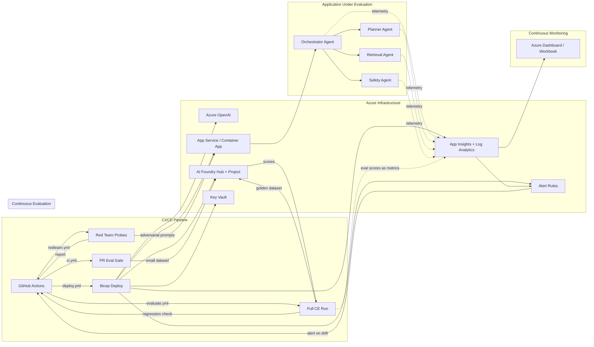

# Architecture — CE/CM-Centric View

> This diagram is narrated through the lens of **Continuous Evaluation** and **Continuous Monitoring**. The multi-agent system is the application under evaluation — not the star of the show.
>
> All components described below are fully implemented and running. See the [README](../README.md) for latest evaluation scores.

---

## Full Architecture Diagram



---

## Component Walkthrough

### CI/CD Pipeline

The pipeline has **four workflows**, each with a distinct CE/CM role:

| Workflow | Purpose | CE/CM Role |
|----------|---------|------------|
| `ci.yml` | PR validation — lint, tests, lightweight eval | CE gate on every PR |
| `deploy.yml` | Deploy Azure infrastructure via Bicep | Infra provisioning (incl. alert rules) |
| `evaluate.yml` | Full evaluation + regression check post-deploy | CE post-deploy |
| `redteam.yml` | Adversarial probes — weekly or manual | CE adversarial |

### Azure Infrastructure

All resources are deployed via Bicep modules in `infra/modules/`:

| Resource | Module | Purpose |
|----------|--------|---------|
| Azure OpenAI | `openai.bicep` | GPT-4o model deployment for the agent system |
| App Service | `app-service.bicep` | Hosts the FastAPI agent application |
| AI Foundry Hub + Project | `ai-foundry.bicep` | Powers the evaluation SDK |
| Application Insights + Log Analytics | `monitoring.bicep` | Telemetry sink for CM |
| Alert Rules | `alerts.bicep` | Azure Monitor alerts for score drops, latency, safety |
| Key Vault | `key-vault.bicep` | Secret storage (connection strings, keys) |
| Managed Identity | `managed-identity.bicep` | RBAC for service-to-service auth |

### Application Under Evaluation

A multi-agent system built with the **Microsoft Agent Framework** — deliberately kept simple because it's the *subject*, not the focus:

| Agent | Responsibility |
|-------|---------------|
| **Orchestrator** | Routes user requests through the Planner → Retrieval → Safety chain via `WorkflowBuilder` |
| **Planner** | Decomposes tasks, decides which agents to invoke |
| **Retrieval** | Fetches grounding context (RAG pattern) |
| **Safety** | Content-safety guardrail — filters unsafe outputs (prompt injection, jailbreak, PII) |

The orchestrator has a built-in fallback: when the Agent Framework is unavailable (e.g., dependency conflicts), it seamlessly falls back to direct Azure OpenAI SDK calls with the same safety guardrails.

### Continuous Evaluation (CE)

The evaluation subsystem in `src/continuous_evaluation/`:

| Component | File | Function |
|-----------|------|----------|
| Full evaluation | `run_evaluation.py` | Runs all evaluators against the 10-row golden dataset via `azure-ai-evaluation` |
| PR evaluation | `run_pr_evaluation.py` | Fast 5-row eval for CI (< 60 seconds) |
| Evaluators | `evaluators.py` | Groundedness, Coherence, Relevance, Fluency, Conciseness + custom `ConcisenessEvaluator` |
| Thresholds | `thresholds.py` | Pass/warn/fail per evaluator — configurable via `CE_THRESHOLD_*` env vars |
| Regression check | `regression_check.py` | Compares current vs. baseline scores, blocks if delta > 0.3 |
| Score tracking | `score_tracker.py` | Pushes scores to App Insights as custom metrics (bridges CE → CM) |
| Retry logic | `retry.py` | Exponential backoff for transient Azure AI evaluation failures |

Red teaming (`src/redteam/`) is adversarial CE — uses the **Azure AI Evaluation Red Team SDK** (`RedTeam` class) with `AttackStrategy.Baseline` and `AttackStrategy.Jailbreak` strategies, plus custom probes for prompt injection, PII extraction, social engineering, and misinformation.

### Continuous Monitoring (CM)

The monitoring subsystem in `src/continuous_monitoring/`:

| Component | File | Function |
|-----------|------|----------|
| Telemetry | `telemetry.py` | OpenTelemetry → App Insights instrumentation |
| Eval metrics export | `eval_metrics_exporter.py` | Bridges CE scores into CM as OTel metrics |
| Alert rules | `alert_rules.py` | Programmatic alert condition definitions |
| Dashboard | `dashboards/ce_cm_dashboard.json` | Azure Workbook with 3 sections |

**Dashboard Sections:**

1. **Evaluation Trends** — Groundedness, Coherence, Relevance, Safety scores over time
2. **Agent Health** — Latency P50/P95/P99, error rate, token usage
3. **Alerts & Regressions** — Score regressions detected, safety flags, active alerts

---

## Data Flow Summary

```
Code Change → PR Eval (CE) → Merge → Deploy → Full Eval (CE) → Regression Check (CE)
                                                      ↓
                                              Score Tracking → App Insights (CM)
                                                      ↓
                                              Alert Rules → Dashboard → Feedback Loop
```

The key insight: **CE feeds CM, and CM feeds CE**. Evaluation scores become monitoring metrics. Monitoring anomalies become new evaluation test cases.

---

## API Surface

The FastAPI application (`src/app.py`) exposes:

| Method | Path | Description |
|--------|------|-------------|
| `GET` | `/` | Interactive chat UI (HTML) |
| `GET` | `/health` | Health check |
| `POST` | `/chat` | Multi-agent orchestrator — target for evaluations and red-team probes |

Every `/chat` request emits OpenTelemetry spans with attributes: `query.length`, `response.length`, `agents.involved`, `duration_ms`, and `status`.
