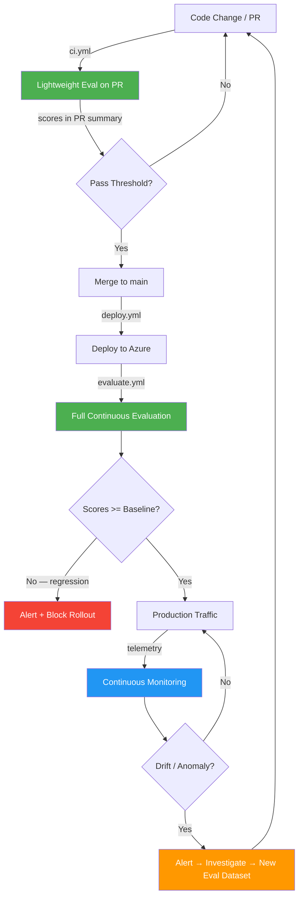

# CE/CM Lifecycle — Continuous Evaluation & Monitoring Loop

> This is the hero diagram for the talk. It shows how every code change flows through automated quality gates before reaching production users, and how production monitoring feeds back into evaluation.

---

## The Lifecycle Loop

---

## Stage-by-Stage Walkthrough

### 1. Code Change / PR

A developer pushes a code change — new agent behavior, updated prompts, model version bump, evaluation dataset update. This triggers the `ci.yml` GitHub Actions workflow.

### 2. Lightweight Eval on PR (CE)

The `ci.yml` workflow runs:
- **Linting** (`ruff check`) + **formatting** (`ruff format --check`)
- **Type checking** (`pyright`)
- **Unit tests** (`pytest tests/unit/`)
- **Lightweight evaluation** — runs the evaluation SDK against a 5-row subset (`eval_golden_small.jsonl`) with pass/fail thresholds

Evaluation scores are posted to `$GITHUB_STEP_SUMMARY` — visible directly in the PR's Checks tab.

### 3. Pass Threshold?

If any evaluator score falls below the threshold defined in `src/continuous_evaluation/thresholds.py`, the CI workflow **fails**. The PR cannot merge until the developer fixes the quality regression.

### 4. Merge to Main

Once all checks pass, the PR is merged. This triggers the `deploy.yml` workflow.

### 5. Deploy to Azure

The `deploy.yml` workflow:
- Logs in via OIDC federated credentials
- Lints the Bicep templates
- Deploys all infrastructure (Azure OpenAI, AI Foundry, App Service, App Insights, Key Vault, alert rules)
- Runs a smoke test against the deployed endpoint

### 6. Full Continuous Evaluation (CE)

The `evaluate.yml` workflow runs automatically after a successful deployment:
- **Full evaluation** against the golden dataset (10-15 rows) using all evaluators (Groundedness, Coherence, Relevance, Fluency, Safety)
- **Regression check** — compares current scores against the last known baseline. If any score dropped beyond a tolerance, the pipeline **fails and alerts**.
- **Score tracking** — pushes evaluation scores as App Insights custom metrics, enabling trend monitoring

### 7. Scores >= Baseline?

If a regression is detected, the pipeline blocks the rollout and fires an alert. The team investigates and fixes before re-deploying.

### 8. Production Traffic

If scores are stable or improved, the deployment proceeds to serve production traffic.

### 9. Continuous Monitoring (CM)

In production, every agent call, LLM invocation, and user interaction emits telemetry via OpenTelemetry → Application Insights:
- **Latency** (P50/P95/P99) per agent
- **Token usage** per request
- **Error rate** and exception tracking
- **Evaluation scores as metrics** — the bridge between CE and CM
- **Safety-flag rate** — how often the safety agent triggers

The Azure Dashboard / Workbook (`ce_cm_dashboard.json`) visualizes all of this in three sections:
1. **Evaluation Trends** — score timelines
2. **Agent Health** — latency, errors, tokens
3. **Alerts & Regressions** — active alert rules, regression history

### 10. Drift / Anomaly?

Azure Monitor alert rules (deployed via `infra/modules/alerts.bicep`) watch for:
- Evaluation score drops below threshold
- Latency spikes beyond P99 baseline
- Safety-flag rate exceeds acceptable level
- Error rate spikes

### 11. Alert → Investigate → New Eval Dataset

When an alert fires, the team investigates the production issue. The finding is codified as new rows in the golden evaluation dataset — closing the feedback loop back to step 1.

---

## Key Insight

The CE/CM loop is **never done**. Every production issue becomes a new test case. Every evaluation run strengthens the baseline. The system gets safer with every iteration — automatically.
