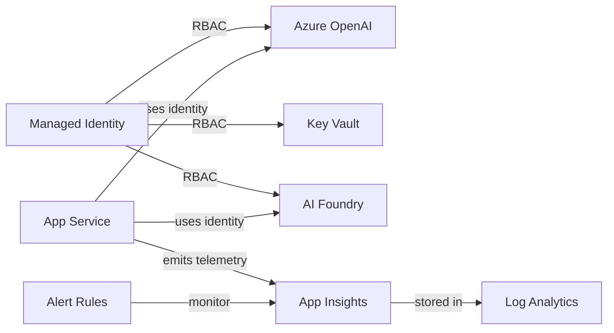

# Azure Infrastructure — Resource Guide

> Every Azure resource in this repo serves one of four purposes: **Application**, **Continuous Evaluation (CE)**, **Continuous Monitoring (CM)**, or **Security**. All resources are defined as Bicep IaC in `infra/` and deployed via `deploy.yml`.

---

## Architecture Wiring



---

## Resource Breakdown

### 1. User-Assigned Managed Identity

| | |
|---|---|
| **Bicep** | [`infra/modules/managed-identity.bicep`](../infra/modules/managed-identity.bicep) |
| **Purpose** | Security |
| **Resource type** | `Microsoft.ManagedIdentity/userAssignedIdentities` |

A single identity shared across all services. Enables **passwordless, key-free authentication** between services. The App Service uses this identity to call Azure OpenAI, AI Foundry, and Key Vault — no API keys or connection strings stored in code.

It gets scoped RBAC roles on each downstream resource:

| Role | Target Resource |
|------|----------------|
| Cognitive Services OpenAI User | Azure OpenAI |
| Key Vault Secrets User | Key Vault |
| Azure AI Developer | AI Foundry Project |

---

### 2. Log Analytics Workspace + Application Insights

| | |
|---|---|
| **Bicep** | [`infra/modules/monitoring.bicep`](../infra/modules/monitoring.bicep) |
| **Purpose** | Continuous Monitoring (CM) |
| **Resource types** | `Microsoft.OperationalInsights/workspaces`, `Microsoft.Insights/components` |

This is the **Continuous Monitoring backbone**. Every agent call, LLM invocation, and evaluation run emits OpenTelemetry traces and metrics here.

- **Log Analytics** — stores raw logs, traces, and custom metrics (30-day retention)
- **Application Insights** — provides the APM experience: distributed tracing, performance dashboards, and KQL queries. The evaluation score tracker pushes `ce.score.*` custom metrics here, bridging CE into CM. The Azure Workbook dashboard reads from this.

> **Deploy order note:** Must deploy *before* AI Foundry because the Hub requires the App Insights resource ID.

---

### 3. Key Vault

| | |
|---|---|
| **Bicep** | [`infra/modules/key-vault.bicep`](../infra/modules/key-vault.bicep) |
| **Purpose** | Security |
| **Resource type** | `Microsoft.KeyVault/vaults` |

**Secure secrets management.** Required by AI Foundry Hub as a dependency. Also stores any connection strings or API keys that the app might need in production.

Key configuration:
- Uses **RBAC authorization** (not access policies) so the managed identity can read secrets without key exchange
- **Soft-delete** enabled (7-day retention) to protect against accidental deletion

---

### 4. Azure OpenAI

| | |
|---|---|
| **Bicep** | [`infra/modules/openai.bicep`](../infra/modules/openai.bicep) |
| **Purpose** | Application + Continuous Evaluation |
| **Resource type** | `Microsoft.CognitiveServices/accounts` |
| **Model** | GPT-4o (Standard SKU, 30K TPM) |

This is the **LLM engine** powering the multi-agent system. The orchestrator, planner, retrieval, and safety agents all call GPT-4o to generate responses.

It also serves double duty for **Continuous Evaluation** — the `azure-ai-evaluation` SDK's built-in evaluators (Groundedness, Coherence, Relevance, Fluency) use GPT-4o as the **judge model** to score responses.

The managed identity gets the *Cognitive Services OpenAI User* role for passwordless access.

---

### 5. AI Foundry Hub + Project

| | |
|---|---|
| **Bicep** | [`infra/modules/ai-foundry.bicep`](../infra/modules/ai-foundry.bicep) |
| **Purpose** | Continuous Evaluation (CE) |
| **Resource type** | `Microsoft.MachineLearningServices/workspaces` (kind: Hub / Project) |

Powers **Continuous Evaluation**. The `azure-ai-evaluation` SDK runs evaluations through the AI Foundry project endpoint. It provides:

- **Evaluation run history** and tracking via `studio_url`
- **Project-level organization** for models and evaluations
- **Integration with App Insights** for telemetry
- The **Red Team SDK** also runs its adversarial scans through this project

The Hub links to Key Vault and App Insights; the Project inherits from the Hub.

---

### 6. App Service Plan + App Service

| | |
|---|---|
| **Bicep** | [`infra/modules/app-service.bicep`](../infra/modules/app-service.bicep) |
| **Purpose** | Application |
| **Resource types** | `Microsoft.Web/serverfarms`, `Microsoft.Web/sites` |
| **SKU** | PremiumV3 (P1v3), Linux, Python 3.12 |

**Hosts the FastAPI agent application** — the "application under evaluation." It serves:

| Endpoint | Description |
|----------|-------------|
| `GET /` | Chat UI |
| `GET /health` | Health check |
| `POST /chat` | Multi-agent orchestrator |

Configuration highlights:
- All environment variables injected as **app settings** (OpenAI endpoint, AI Foundry project, App Insights connection string, etc.)
- Uses the **user-assigned managed identity** for auth
- **HTTPS-only**, FTPS disabled (security hardened)
- Startup via `startup.sh`

The Red Team SDK and evaluation workflows call this App Service as the **target to evaluate**.

---

### 7. Azure Monitor Alert Rules

| | |
|---|---|
| **Bicep** | [`infra/modules/alerts.bicep`](../infra/modules/alerts.bicep) |
| **Purpose** | Continuous Evaluation + Continuous Monitoring |
| **Resource type** | `Microsoft.Insights/metricAlerts` |

Four metric alert rules scoped to Application Insights:

| Alert | Category | Severity | Trigger |
|-------|----------|----------|---------|
| **Groundedness Score Drop** | CE | 1 (Error) | `ce.score.groundedness` < 4.0 (15-min avg) |
| **Safety Violation** | CE | 0 (Critical) | `ce.score.safety` < 5.0 (5-min avg) |
| **Agent Latency P99** | CM | 2 (Warning) | `agent.request.duration` > 5000ms |
| **Agent Error Rate** | CM | 1 (Error) | `agent.error.count` > 10 in 5 min |

These close the **CE/CM feedback loop** by automatically alerting when:
- Evaluation quality scores drift below thresholds (catches regressions in production)
- The agent becomes slow or starts erroring (operational health)

All deployed as IaC so alerts are **version-controlled and reproducible**.

---

## Resource-to-Purpose Map

| Resource | Application | CE | CM | Security |
|----------|:-----------:|:--:|:--:|:--------:|
| Managed Identity | | | | ✅ |
| Log Analytics | | | ✅ | |
| Application Insights | | | ✅ | |
| Key Vault | | | | ✅ |
| Azure OpenAI (GPT-4o) | ✅ | ✅ | | |
| AI Foundry Hub + Project | | ✅ | | |
| App Service | ✅ | | | |
| Alert Rules | | ✅ | ✅ | |

---

## Deployment

All resources deploy idempotently via the orchestrator:

```bash
az deployment group create \
  --resource-group <rg-name> \
  --template-file infra/main.bicep \
  --parameters infra/parameters/dev.bicepparam
```

The `deploy.yml` GitHub Actions workflow automates this with OIDC federated credentials.
